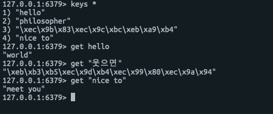

# Redis Spring-boot 연동

## Intellij에서 스프링 부트 프로젝트 신규 세

1. 1.  File &gt; New &gt; Project 선택
2. Spring Initializr 선택
3. Group과 Name을 프로젝트에 맞게 설정
4. 추가할 Dependency 를 선택 해줌 

   1. srping-boot-starter-data-redis
   2. spring-boot-starter-web
   3. lombock
   4. spring-boot-starter-test

5. 프로젝트 생성

### Redis연동

우선 아래와 같이 Application.properties에 레디스 설정 정보를 입력한다.


```text
spring.redis.host=127.0.0.1
spring.redis.password=
spring.redis.port=6379
```


그리고 아래와 같이 테스트 코드를 작성 한다. StringRedisTemplate를 주입 받아 set을 해준다.

```java
@RunWith(SpringRunner.class)
@SpringBootTest
class RedisHelloWorldTest {
	@Autowired
	private StringRedisTemplate template;

	@Test
	public void helloWorld_Test() {
		ValueOperations<String, String> values = template.opsForValue();
		values.set("hello", "world");
		values.set("웃으면", "복이와요");
		values.set("nice to", "meet you");
	}
}
```

테스트 코드를 수행해보면 아래와 같이 redis-cli를 통해서 확인 해볼수 있다.

특이한 점은 한글을 입력하면 인코딩 되서 입력이 되나보다.




